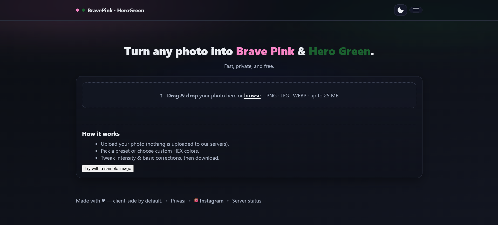

# 🎨 Brave Pink / Hero Green Photo Editor

 
 
 


A complete, ready-to-run web app to make **Brave Pink**, **Hero Green**, or **Resistance Blue** duotone profile photos.

> 🌐 Bahasa Indonesia ada di bawah / Indonesian version below.

---

## 🚀 Features
- **Frontend**: Vanilla JS + Canvas → fast, lightweight, and **100% private** (no auto upload).
- **Backend**: Node.js (Express + Jimp) → optional server-side processing via `/api/process`.
- **Built-in presets**:
  - Brave Pink → `#F784C5`
  - Hero Green → `#1B602F`
  - Resistance Blue → `#0A1B6E`
- **Dark/Light mode toggle**.
- **Responsive UI** → clean on both desktop and mobile.

---

## ⚡ Quick Start

### 1. Clone & Install
```bash
git clone https://github.com/dxhys/brave-pink-hero-green.git
cd brave-pink-hero-green
npm install
```

### 2. Run
```bash
npm start
# then open http://localhost:3000
```

### 3. (Optional) Server-Side Processing
Copy `.env.example` to `.env` and configure as needed.
```bash
cp .env.example .env
```

---

## 📸 Screenshots

### Desktop


### Mobile


---

## 🛠️ Tech Stack
- **Frontend** → HTML5, CSS3, Vanilla JavaScript
- **Image Processing** → HTML5 Canvas (client-side), Jimp (server-side)
- **Backend (optional)** → Node.js + Express

---

## 👨‍💻 Contributing
Pull requests are welcome!  
Feel free to fork, improve, and submit PRs.

---

## 📄 License
MIT License

---

# 🇮🇩 Brave Pink / Hero Green Photo Editor

Aplikasi web siap pakai untuk membuat foto profil duotone dengan tema **Brave Pink**, **Hero Green**, atau **Resistance Blue**.

---

## 🚀 Fitur
- **Frontend**: Vanilla JS + Canvas → ringan, cepat, dan **100% privat** (foto tidak diunggah ke server).
- **Backend**: Node.js (Express + Jimp) → untuk opsi proses gambar via server `/api/process`.
- **Preset bawaan**:
  - Brave Pink → `#F784C5`
  - Hero Green → `#1B602F`
  - Resistance Blue → `#0A1B6E`
- **Mode Gelap/Terang** (Dark/Light mode).
- **Tampilan Responsif** → rapih di desktop maupun mobile.

---

## ⚡ Cara Cepat Menjalankan

### 1. Clone & Install
```bash
git clone https://github.com/dxhys/brave-pink-hero-green.git
cd brave-pink-hero-green
npm install
```

### 2. Jalankan Aplikasi
```bash
npm start
# buka http://localhost:3000
```

### 3. (Opsional) Proses via Server
Salin `.env.example` ke `.env` untuk konfigurasi server-side.
```bash
cp .env.example .env
```

---


## 🛠️ Teknologi yang Digunakan
- **Frontend** → HTML5, CSS3, Vanilla JavaScript
- **Pengolahan Gambar** → HTML5 Canvas (client-side), Jimp (server-side)
- **Backend (opsional)** → Node.js + Express

---

## 👨‍💻 Kontribusi
Pull request selalu terbuka!  
Silakan fork, dan kembangkan.
